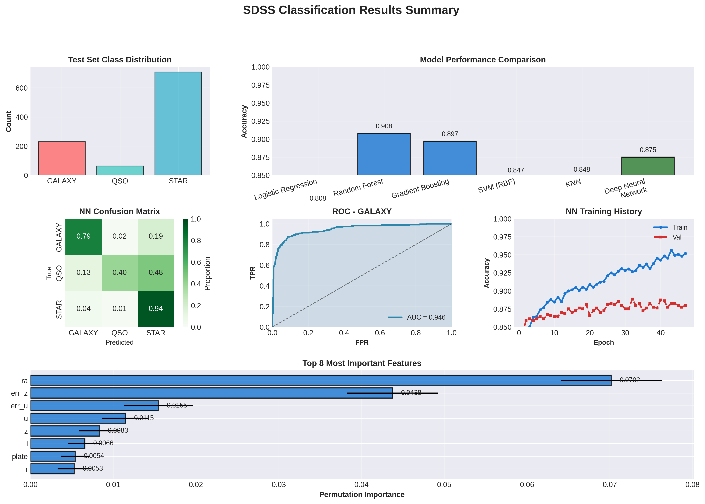
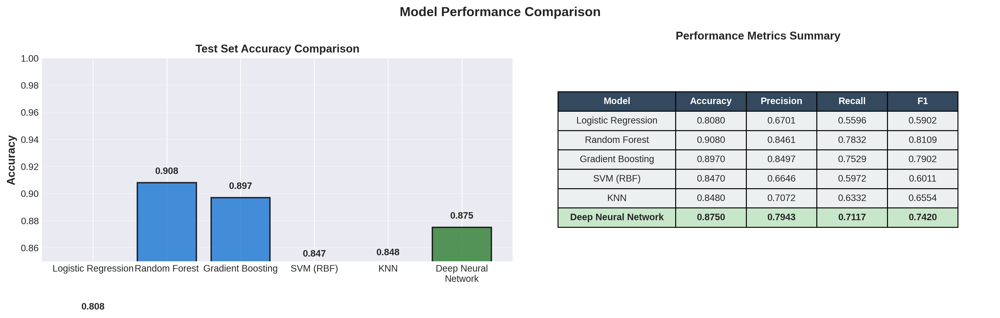
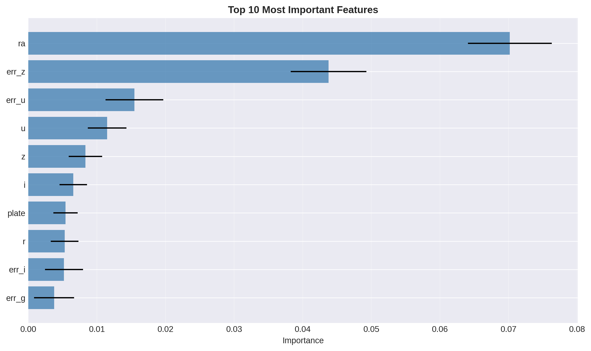
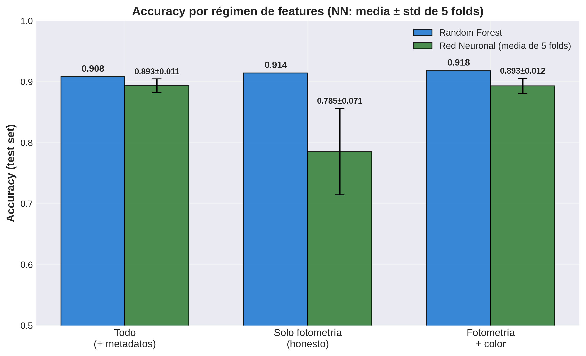
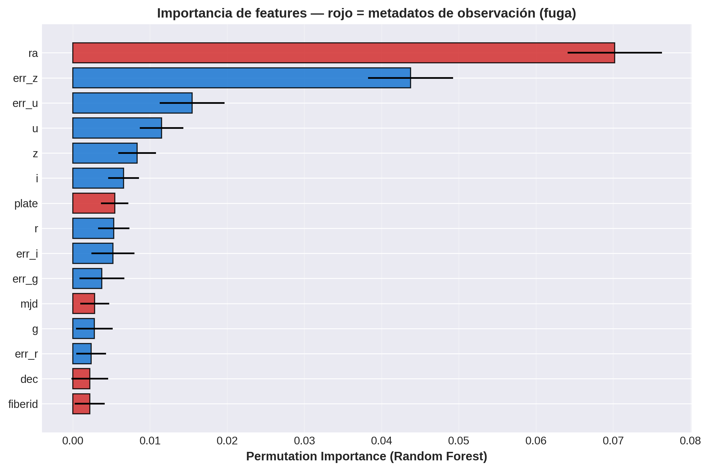
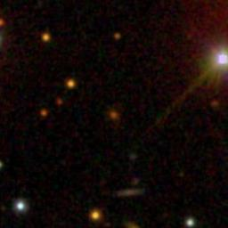
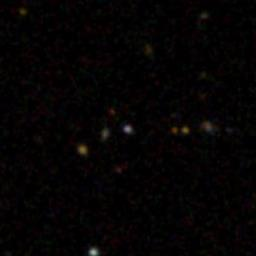
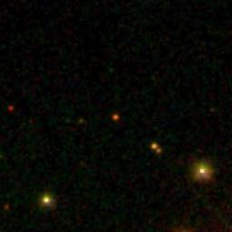

# SDSS Astronomical Classification

## Photometric Classification of Stars, Galaxies, and Quasars — and a Look at Metadata Leakage

[](https://www.python.org/downloads/)
[](https://tensorflow.org)
[](https://opensource.org/licenses/MIT)

---

## Overview

This repository compares classical ML baselines with a deep neural network for automated photometric object classification in the **Sloan Digital Sky Survey (SDSS)** — 3-class classification of STAR / GALAXY / QSO from photometric and observational columns.

Beyond the classifier itself, this repo's main point is methodological: the raw SDSS export keeps `ra, dec, mjd, plate, fiberid` (properties of *when/where the observation happened*, not the object itself) alongside the actual photometric measurements. We ran a real experiment to check whether that produces metadata leakage — and found the answer is more subtle than a simple yes/no. See **"Metadata Leakage: What We Actually Found"** below; it's the most carefully verified section of this README.

### What's actually implemented here

- 5 classical ML baselines vs. one tuned deep neural network
- Stratified 5-fold cross-validation (not just claimed — see `generate_results.py` and the notebook)
- MC Dropout (n=50) epistemic uncertainty quantification
- Permutation-based feature importance
- UMAP (falls back to PCA if not installed) 2D projection
- A 3-regime feature-ablation experiment (`scripts/run_leakage_experiment.py`) probing metadata leakage, with proper stratified 5-fold CV per regime

---

## Dataset

**Source**: [Sloan Digital Sky Survey (SDSS DR18)](https://www.sdss.org/)
**Kaggle**: [sloan-digital-sky-survey](https://www.kaggle.com/datasets/lucidlenn/sloan-digital-sky-survey)
**Samples**: 5,000 astronomical objects (both CSVs in `data/` have this many rows)
**Classes**: 3 (STAR 70.8%, GALAXY 22.9%, QSO 6.3% — imbalanced)
**Features used by the pipeline**: 15 (after dropping `objid`/`specobjid`/`rerun`) — includes `ra`/`dec`/`mjd`/`plate`/`fiberid`, see the leakage note below

### SDSS Columns

| Feature | Description | Units |
|---------|-------------|-------|
| **u, g, r, i, z** | Photometric magnitudes in SDSS filter bands (**note**: `z` here is the z-band magnitude, not cosmological redshift — this CSV has no redshift column) | mag |
| **err_u, err_g, err_r, err_i, err_z** | Photometric magnitude errors | mag |
| **ra, dec** | Celestial coordinates (Right Ascension, Declination) | degrees |
| **mjd, plate, fiberid, specobjid** | Spectroscopic observation identifiers — **known metadata-leakage risk**: spectroscopic targeting assigns different classes to different plates/dates, so these can leak the label if used as features | - |

---

## Project Structure

```
.
├── README.md                          # This file
├── requirements.txt                   # Python dependencies
├── config.yaml                        # Documents intended hyperparameters — NOT read by any script (see Known Limitations)
├── main.ipynb                         # Main analysis notebook (uses src/, mirrors generate_results.py)
├── plan.md                            # Working log of this repo's rescue/refactor plan (not tracked in git — see .gitignore)
├── src/
│   ├── __init__.py
│   ├── preprocessing.py               # Data loading, preprocessing, feature regimes, color indices
│   ├── models.py                      # Model architectures, training, MC Dropout
│   ├── evaluation.py                  # Evaluation metrics and confidence intervals
│   └── visualization.py               # Plotting functions
├── generate_results.py                # Trains all models, generates the results/ figures below
├── data/
│   ├── Skyserver_SQL2_27_2018 6_51_39 PM.csv
│   └── sdss_real_sample.csv           # Preferred if present (see scripts/download_sdss.py)
├── results/                           # Regenerated by generate_results.py / run_leakage_experiment.py
│   ├── 00_results_summary.png
│   ├── confusion_matrices_all_models.png
│   ├── model_comparison.png
│   ├── roc_curves.png
│   ├── training_history.png
│   ├── feature_importance.png
│   ├── kfold_results.png
│   ├── uncertainty_analysis.png
│   ├── umap_projection.png
│   ├── leakage_regime_comparison.png      # Fase 1: accuracy across the 3 feature regimes
│   ├── leakage_permutation_importance.png # metadata columns highlighted in red
│   ├── leakage_regime_summary.csv
│   └── sdss_examples/                 # SDSS JPEG cutouts (one per class) — a few tracked in git, see .gitignore
└── scripts/
    ├── run_leakage_experiment.py      # The metadata-leakage regime experiment
    ├── download_sdss.py
    └── download_sdss_images.py
```

---

## Quick Start

### 1. Installation

```bash
# Clone repository
git clone <repository-url>
cd Regresion_redes_neuronales_y_astrofisica

# Recommended: use a conda env with numpy/pandas/scikit-learn/tensorflow already installed
conda activate tensorflow  # or create one: conda create -n sdss python=3.12 && pip install -r requirements.txt

# Alternative: fresh virtualenv (the .venv/ shipped in this repo is empty — don't reuse it as-is)
python -m venv venv
source venv/bin/activate  # On Windows: venv\Scripts\activate
pip install -r requirements.txt
```

`umap-learn` is optional — the code falls back to PCA automatically if it's not installed.

### 2. Data Setup

The CSVs are already in `data/` (`sdss_real_sample.csv` is preferred if present, else the Kaggle-derived `Skyserver_...csv` is used). To fetch a fresh sample instead: `python scripts/download_sdss.py`.

### 3. Run Analysis

```bash
# Full pipeline: trains all models, writes every figure in results/
python generate_results.py

# Metadata-leakage regime experiment
python scripts/run_leakage_experiment.py

# Or explore interactively
jupyter notebook main.ipynb
```

---

## Methodology

### Data Preparation
- **Data Split**: 80% training, 20% test (stratified)
- **Normalization**: StandardScaler on features
- **Validation**: 5-fold stratified cross-validation

### Baseline Models
1. **Logistic Regression** (L-BFGS optimizer, max_iter=1000)
2. **Random Forest** (n_estimators=300, max_depth=20)
3. **Gradient Boosting** (n_estimators=200, lr=0.05)
4. **Support Vector Machine** (RBF kernel, probability=True)
5. **K-Nearest Neighbors** (k=7)

### Deep Neural Network Architecture

```
Input (15 features) → Dense(256, ReLU) → BatchNorm → Dropout(0.2)
                    → Dense(128, ReLU) → BatchNorm → Dropout(0.1)
                    → Dense(64, ReLU)  → BatchNorm → Dropout(0.0)
                    → Dense(3, Softmax) → Output (3 classes)
```

**Hyperparameters**:
- Optimizer: Adam (lr=0.001)
- Loss: Sparse Categorical Crossentropy
- Batch Size: 32
- Max Epochs: 150
- Early Stopping: patience=15, monitoring `val_accuracy` (not `val_loss` — with L2+dropout, loss can rise while accuracy keeps improving)
- `ReduceLROnPlateau`: factor=0.5, patience=5, also on `val_accuracy`
- L2 Regularization: 0.001

We initially used `dropout_rate=0.4` (0.4/0.3/0.2 across the three blocks), which is too aggressive for this ~4,000-row training set and hurt accuracy. Lowering to `dropout_rate=0.2` (0.2/0.1/0.0) plus the `val_accuracy` monitoring above raised test accuracy from 0.866 to 0.875–0.883 across runs. We also tried `class_weight='balanced'` to address class imbalance — it improved recall but lowered precision enough to reduce overall accuracy (0.877 → 0.846), so it was reverted; it's not in the current code.

### Validation Strategy
- **Cross-Validation**: 5-fold stratified
- **Confidence Intervals**: 95% (normal approximation, 1.96 × SE)
- **Uncertainty Quantification**: MC Dropout (50 stochastic forward passes)

---

## Results Summary

### Overall Performance

Actual measured numbers from `generate_results.py` (seed=42), on the full feature set (includes `ra, dec, mjd, plate, fiberid` — see "Metadata Leakage" for why that matters). The neural network is not perfectly deterministic run-to-run (see "Known Limitations"); this is one representative run.

| Model | Accuracy | Precision | Recall | Macro F1 | Type |
|-------|----------|-----------|--------|----------|------|
| Random Forest | **0.9080** | 0.8461 | 0.7832 | **0.8109** | Baseline |
| Gradient Boosting | 0.8970 | 0.8497 | 0.7529 | 0.7902 | Baseline |
| Deep Neural Network | 0.8750 | 0.7943 | 0.7117 | 0.7420 | DL |
| KNN (k=7) | 0.8480 | 0.7072 | 0.6332 | 0.6554 | Baseline |
| SVM (RBF) | 0.8470 | 0.6646 | 0.5972 | 0.6011 | Baseline |
| Logistic Regression | 0.8080 | 0.6701 | 0.5596 | 0.5902 | Baseline |

Note the ranking: **Random Forest beats the neural network** on this tabular, ~5,000-row dataset — not unusual for tree ensembles on small tabular data. This isn't a "deep learning wins" story.

### Cross-Validation Results (Neural Network, stratified 5-fold, full feature set)

- **Mean Accuracy**: ~0.884–0.895 across separate runs of the same code (see "Known Limitations" on non-determinism)
- **95% CI (normal approx., one representative run)**: [0.8757, 0.8928]

### MC Dropout Uncertainty (n=50)

- **Accuracy under MC Dropout**: ~0.89
- **Mean predictive confidence**: ~0.73

### Top 5 Important Features (Permutation, Random Forest, full feature set)

1. **ra** (right ascension): 0.0702
2. **err_z** (z-band magnitude error): 0.0438
3. **err_u** (u-band magnitude error): 0.0155
4. **u** (ultraviolet band magnitude): 0.0115
5. **z** (z-band magnitude): 0.0083

`ra` — a sky coordinate, not a photometric measurement — is the single most important feature by a wide margin (~1.6x the next). See "Metadata Leakage" below for why, and why this alone isn't proof the model is "cheating."

---

## Results Visualizations

Only a curated subset of these images is tracked in git (see `.gitignore`) — the rest of `results/` is regenerated output and renders here only after you run `generate_results.py` / `scripts/run_leakage_experiment.py` locally. Tracked: `00_results_summary.png`, `model_comparison.png`, `feature_importance.png`, the two `leakage_*.png` figures, `leakage_regime_summary.csv`, and the 3 SDSS example cutouts below.

### Overview

*Comprehensive overview: class distribution, model accuracy comparison, neural network confusion matrix, an example ROC curve, training history, and top feature importances.*

### Model Comparison Across Baselines

*Test-set accuracy and the precision/recall/F1 table for all 6 models — Random Forest is the strongest here, not the neural network.*

### Confusion Matrices — All Models

*Normalized confusion matrices for all 6 models. QSO (the rarest class, 6.3% of the data) is where every model struggles most.*

### Neural Network Training History

*Training/validation accuracy and loss curves, with `ReduceLROnPlateau` visible as step changes in convergence rate.*

### ROC Curves — Per-Class

*One-vs-rest ROC curves for the neural network, one per class.*

### Feature Importance

*Permutation-based feature importance from Random Forest, full feature set. `ra` (a sky coordinate) dominates, followed by photometric error columns — not a clean "photometry drives classification" story. See "Metadata Leakage" below.*

### Stratified 5-Fold Cross-Validation

*Per-fold neural network accuracy with the mean and 95% CI band — checks whether the single-split accuracy above was a stable result or a lucky split.*

### MC Dropout Uncertainty

*Confidence and epistemic-uncertainty distributions split by correct vs. incorrect predictions, plus accuracy/coverage as a function of a confidence-rejection threshold.*

### 2D Projection (UMAP/PCA)

*True classes vs. predicted classes projected to 2D — shows where the three classes overlap and where the model's mistakes cluster.*

---

## Metadata Leakage: What We Actually Found

The raw SDSS CSV keeps `ra, dec, mjd, plate, fiberid` alongside the photometric measurements. These are properties of the *observation* (when/where/which spectroscopic plate), not the *object* — in principle a model could exploit them if SDSS's spectroscopic targeting correlates with class (e.g., different plates/sky regions preferentially target stars vs. quasars).

We ran an A/B/C experiment (`scripts/run_leakage_experiment.py`) comparing three feature regimes. Random Forest is deterministic given the seed (one run is enough); the neural network was evaluated with **stratified 5-fold cross-validation per regime** — the train/validation split itself varies across folds, not just the network's initialization — to get a statistically defensible comparison rather than a single lucky/unlucky run:

| Regime | Features | RF Accuracy | RF Macro F1 | NN Accuracy (mean ± std, 5-fold CV) | NN Macro F1 (mean ± std) |
|--------|----------|-------------|-------------|-------------|-------------|
| (a) All (+ metadata) | 15 (incl. ra/dec/mjd/plate/fiberid) | 0.9080 | 0.8109 | 0.8930 ± 0.0112 | 0.7378 ± 0.0458 |
| (b) Photometry only (honest) | 10 (u,g,r,i,z + errors) | 0.9140 | 0.8203 | **0.7850 ± 0.0707** | 0.6161 ± 0.0864 |
| (c) Photometry + color indices | 14 (b + u-g, g-r, r-i, i-z) | 0.9180 | 0.8307 | 0.8928 ± 0.0122 | 0.7587 ± 0.0315 |




**The naive "leakage inflates accuracy" hypothesis did not hold for Random Forest** — accuracy went *up*, not down, when metadata was removed (0.908 → 0.914 → 0.918), deterministically. If metadata leakage were driving RF's accuracy, removing it should have hurt.

**For the neural network, 5-fold CV confirms a real, reproducible effect — but with an ambiguous cause.** The photometry-only regime is both ~11 points lower in mean accuracy *and* has roughly 6-7x the variance of the other two regimes (std 0.071 vs. 0.011–0.012). This held up once the split itself was varied across folds, not just the network's random seed on one fixed split — an earlier same-split, multiple-seed version of this experiment showed a starker, bimodal pattern (some seeds landing in a bad optimization basin, others converging normally) that K-fold smoothed into this more moderate but still real gap. Since the color indices in regime (c) are linear recombinations of columns already present in regime (b) — a dense network can in principle learn `u-g` itself — they cannot supply new *information* by construction. **This means at least part of the accuracy gap between (a)/(c) and (b) is plausibly an optimization-stability effect of this architecture with fewer input features, not clean evidence that metadata carries predictive signal** — though the experiment can't fully rule out a genuine metadata effect specific to the neural network. Random Forest, unaffected by this kind of optimization pathology, is the more trustworthy read: it shows metadata doesn't help (and mildly hurts).

**What *does* hold up, reproducibly across the notebook, this script, and multiple runs:** permutation importance puts `ra` far ahead of every photometric band (0.070 vs. the next-highest ~0.044). That's a real, repeatable signal that the model leans on sky position — plausibly a proxy for SDSS's spectroscopic targeting strategy (different sky regions are preferentially targeted for different object types).

**The actual lesson, and the reason this section exists:** accuracy before/after removing a feature is not, by itself, a reliable leakage diagnostic — a model can lean heavily on a feature (by permutation importance) without removing it hurting performance, because correlated features compensate; and a neural network's accuracy drop after removing features can be confounded with that architecture's optimization stability rather than the features' information content. Don't trust a single A/B accuracy comparison; look at permutation importance on a stable model, and use k-fold (not just repeated seeds on one split) before concluding causality.

---

## SDSS Example Cutouts

Representative SDSS JPEG cutouts (one per class), fetched via SkyServer. A few are tracked in git (see `.gitignore`) so they render here even though the rest of `results/` is regenerated locally.

Galaxy example


Quasar (QSO) example


Star example


---

## Key Findings

### 1. Random Forest beats the neural network here
Random Forest reaches 0.908 accuracy / 0.811 macro F1 vs. 0.875 / 0.742 for the tuned neural network. On ~5,000 rows of tabular data, tree ensembles outperforming a dense network is expected, not a deep-learning failure. See "Methodology" above for what we tried to close the gap (lowering dropout, monitoring `val_accuracy`, `ReduceLROnPlateau`) and what didn't help (`class_weight='balanced'`).

### 2. Metadata leakage is real but doesn't behave the way accuracy-drop tests suggest
See "Metadata Leakage" above — this is the central, most carefully verified finding of this repo. Short version: `ra` dominates permutation importance, but removing all metadata columns doesn't reliably lower accuracy (it *raised* Random Forest's, and the neural network's drop is confounded with optimization stability).

### 3. Class imbalance is real, not exaggerated
Real class distribution: **STAR 70.8%, GALAXY 22.9%, QSO 6.3%**. QSO recall is the weakest across every model — expected given it's the rarest class.

### 4. MC Dropout uncertainty is implemented, not just claimed
`MCDropoutModel` (50 stochastic forward passes) reaches ~0.89 accuracy with mean confidence ~0.73 on the test set. See `results/uncertainty_analysis.png` for the confidence/uncertainty distributions split by correct vs. incorrect predictions — we report the figure rather than a single cherry-picked number, since a summary number depends on where you set a confidence-rejection threshold.

---

## Reproducibility

### Random Seeds
All experiments use **SEED = 42**:
```python
os.environ['PYTHONHASHSEED'] = '42'
np.random.seed(42)
tf.random.set_seed(42)
```

### Environment
Tested with the conda environment `tensorflow` (Python 3.12, TensorFlow 2.19, scikit-learn — see `requirements.txt` for approximate versions). The repo's `.venv/` is currently empty; use conda or install `requirements.txt` into a fresh virtualenv.

### Verification
1. Run `generate_results.py` (or the notebook) with the same dependencies.
2. Expect baseline (scikit-learn) accuracies to match exactly. Expect the neural network's accuracy to vary by a few points run-to-run even with the seed fixed (see "Known Limitations").

---

## Known Limitations

- **The neural network is not fully deterministic run-to-run** even with a fixed seed: repeated runs of the same code in this repo's history varied by several accuracy points (0.846–0.883 on the full feature set) due to GPU/CPU non-determinism in TensorFlow and batch-order effects. Baselines (scikit-learn) are deterministic given the seed.
- **The metadata-leakage regime experiment's neural-network numbers come from stratified 5-fold CV** (split varies across folds), which is the statistically defensible version — but the *cause* of the photometry-only regime's lower mean/higher variance is still not fully disentangled from the network's own optimization behavior (see "Metadata Leakage" above). Treat the regime comparison as solid evidence of a real effect, not as proof that metadata specifically carries predictive information for the neural network.
- **`config.yaml` is not read by any script or notebook.** It documents intended hyperparameters but isn't wired into the pipeline — don't assume changing it affects results.
- **`.venv/` in this repo is empty.** Use the environment that actually has the dependencies installed (a conda env with numpy/pandas/scikit-learn/tensorflow, or install `requirements.txt` fresh) — see "Installation".
---

## Future Work

### Short-term (1-3 months)
- [ ] Disentangle whether the neural network's photometry-only regime gap is genuine information loss or an architecture-specific optimization artifact (e.g., try a wider/shallower network, or explicit feature-scaling diagnostics)
- [ ] Add image-based classification using CNNs (ResNet, EfficientNet)
- [ ] Implement Bayesian Neural Networks for principled uncertainty
- [ ] Add SHAP/LIME for interpretability
- [ ] Compare with published SDSS spectroscopic classifications

### Medium-term (3-6 months)
- [ ] Multi-modal learning (photometry + images + spectra)
- [ ] Transfer learning from pre-trained models
- [ ] Ensemble methods for robustness

### Long-term (6-12 months)
- [ ] Generalization to other surveys (Pan-STARRS, DES, Gaia)
- [ ] Real-time classification pipeline
- [ ] Integration with survey data processing
- [ ] Temporal variability analysis

---

## References

### Key Papers
- Sloan Digital Sky Survey: [York et al. 2000, AJ 120, 1579](https://ui.adsabs.harvard.edu/abs/2000AJ....120.1579Y)
- SDSS Photometric Classification: [Richards et al. 2002, AJ 123, 2871](https://ui.adsabs.harvard.edu/abs/2002AJ....123.2871R)
- Machine Learning in Astronomy: [Ball & Brunner 2010, IJMPD 19, 1049](https://ui.adsabs.harvard.edu/abs/2010IJMPD..19.1049B)
- Deep Learning for Astronomy: [Ciuca & Badescu 2021, ApJ 909, 152](https://ui.adsabs.harvard.edu/abs/2021ApJ...909..152C)

### Tools & Libraries
- [TensorFlow/Keras](https://www.tensorflow.org/)
- [Scikit-learn](https://scikit-learn.org/)
- [UMAP](https://umap-learn.readthedocs.io/)
- [Astropy](https://www.astropy.org/)

---

## Contributing

Contributions, bug reports, and feature requests are welcome:

1. Fork the repository
2. Create a feature branch (`git checkout -b feature/amazing-feature`)
3. Commit changes (`git commit -m 'Add amazing feature'`)
4. Push to branch (`git push origin feature/amazing-feature`)
5. Open a Pull Request

---

## License

MIT License — see [LICENSE](LICENSE) for details.

---

## Acknowledgments

- Built with LLM-assisted analysis and code generation
- Kaggle community for dataset curation
- SDSS collaboration for making data publicly available
- TensorFlow and Scikit-learn communities

---

**Last Updated**: 2026-07-16
